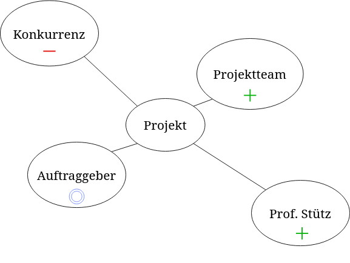

= Umfeldanalyse

== Tabelle

|===
| **Einflussgröße** | **Sachlich / Sozial** | **Einfluss auf Projekt** |  **Einstellung zum Projekt (falls soziale Einflussgröße) (positiv, negativ, neutral)** 
|Projektteam |sozial |hoch |Positiv
|Konkurrenz |sozial |mittel |Negativ
|Auftraggeber |sozial |hoch |Neutral
|Recht |sachlich |gering|
|andere Projekte im Unternehmen |sachlich |mittel|
|Projektstrategie |sachlich |hoch |
|Herr Prof. Stütz |sozial | mittel | Positiv
|===

== Grafik

